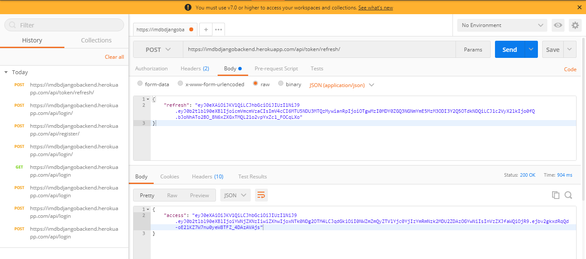

# IMDB

### Introduction

This application is a cloned **IMDBMovie** Simple Web app. Following are the some features of **IMDBMovie**
- User/AdminUser can login/register with the application
- User can see the movies list and search the movies
- Admin User can create the movie instance, update and Delete existing movie
- Normal User/AnyonomousUser won't allow for do the any create update and delete
- User/Admin can logout from application
- Retriving movies based on user interest if he scroll down then frontend server will call backend server api to get nextset of result.


### Tech Stack
1. Frontend Framework
    - Angular
    - HTTP Interceptor
    - JWT Authentication
    - AuthGuard
    - HTML, CSS, JS, TypeScript, Bootstap
    
2. Backend Frameowork
    - Django
    - DjangoRestFramework
    - Full Fledged REST API
    - Python
 
 3. Deployment
    - Heroku - Frontend Angular (different server)
    - Heroku - Backend Django (different server)
    

# Steps to Configure the Project

### Installing Requirements
- Python
- Angular CLI
- node

### Installing Libreries
- Open backend folder and run the below command to install required libreries for Python django and setup the virtual env
and start backend server
   - > cd IMDB_DJANGO_BACKEND 
   - > py -m pip install --user virtualenv 
   - > py -m venv env 
   - > .\env\Scripts\activate 
   - > pip install -r requirements.txt
   - > python manage.py runserver
- Open Frontend folder and run the below command to setup the Angular frontend and start frontend server
   - > cd IMDB-Frontend 
   - > npm install
   - > ng serve
                                                   

# Snipptes

### FrontEnd-Backend Integrated Snniptes
- Login

- SignUp

- Anonymous User Home Page View

- Anonymous User Search Page View

- No Search Result Page

- Normal User Login Home Page View

- Admin Home Page View

- Admin Add Movie Page (Only Admin Access)

- After Adding Movie SpiderMan

- Updating Movie (Only Admin Access)

- After Movie  Updated

- Before Delete (Admin Access)

- After Delete (Admin Access)


### Backend API POSTMAN Snniptes
1-  Register API (POST)
- > https://imdbdjangobackend.herokuapp.com/api/login/
```json
{
   "username":"tset2",
   "password":"test2",
   "email":"test2@gmail.com"
}
```


2- Edit Profile

- Story Detail

- Other User Profile

- Edit Profile

- Story Detail

- Other User Profile

- Edit Profile

- Story Detail

- Other User Profile

- Edit Profile

- Story Detail

- Other User Profile

- Edit Profile

- Story Detail

- Other User Profile

- Other User Profile

- Other User Profile

- Other User Profile

- Other User Profile

- Other User Profile


